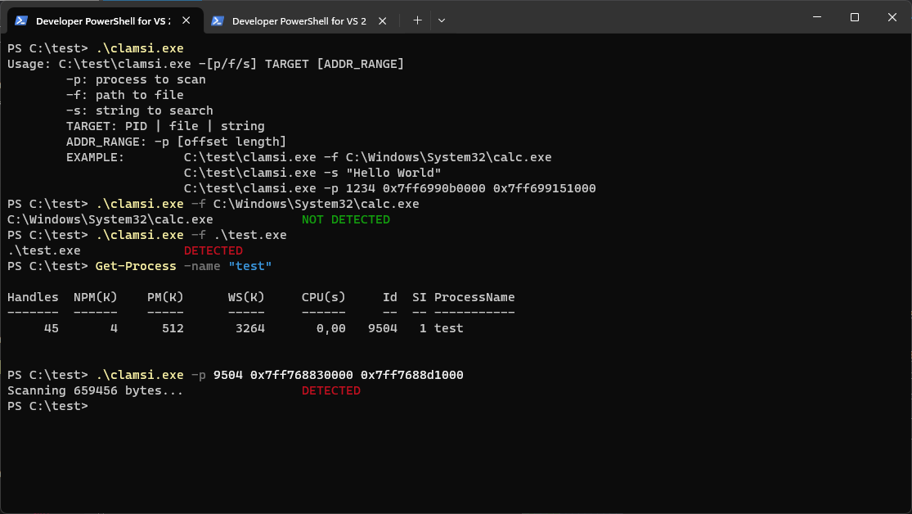
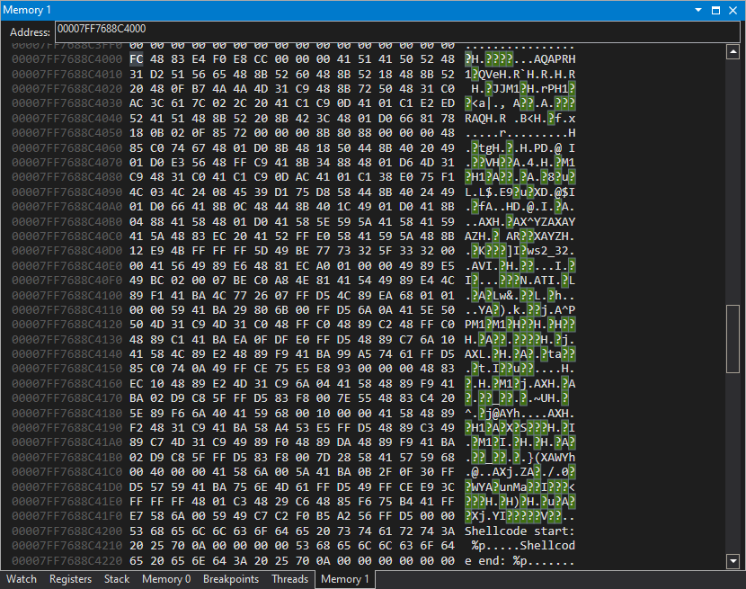

# clamsi

### Command Line for Antimalware Scan Interface (AMSI)



Simple (250 LoC) command line client for AMSI coded for fun. 

#### Syntax
```
Usage: C:\test\clamsi.exe -[p/f/s] TARGET [ADDR_RANGE]
        -p: process to scan
        -f: path to file
        -s: string to search
        TARGET: PID | file | string
        ADDR_RANGE: -p [offset length]
        EXAMPLE:        C:\test\clamsi.exe -f C:\Windows\System32\calc.exe
                        C:\test\clamsi.exe -s "Hello World"
                        C:\test\clamsi.exe -p 1234 0x7ff6990b0000 0x7ff699151000
